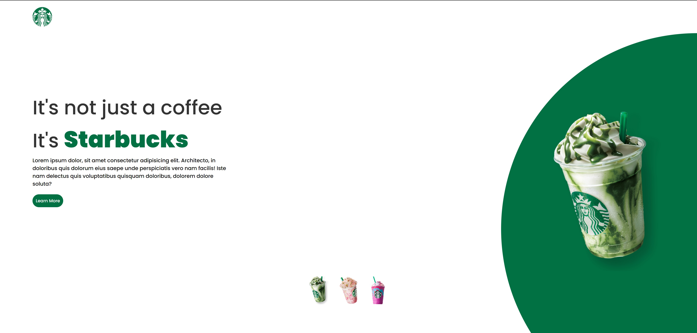

<h1 align="center"> Starbucks </h1>

 

  

 

[ 🔗 Clique aqui para acessar](https://antoniofarjala.github.io/starbucks-project)
 
## 🚀 Tecnologias

Esse projeto foi desenvolvido com as seguintes tecnologias:

- HTML e CSS
- JavaScript

## 💻 Projeto

Este é um pequeno projeto que simula o site do Starbucks, onde é possível atualizar elementos HTML via DOM.
